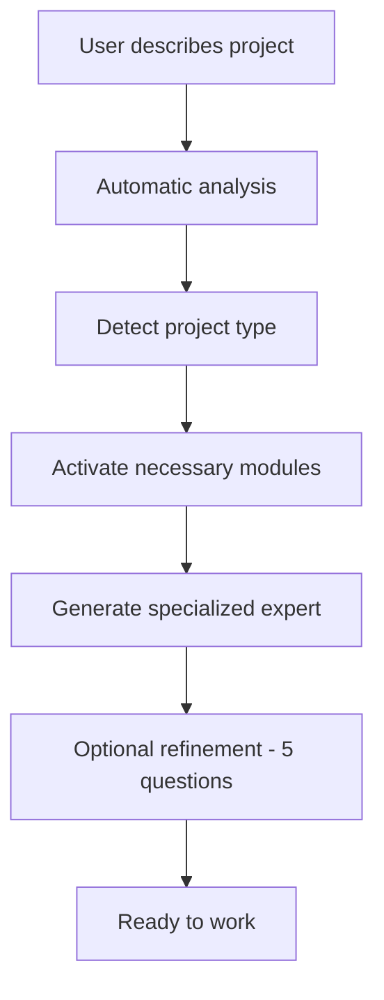

# 🚀 **KORE KONTEXT**

**Intelligent enterprise system to accelerate projects using AI**

[](https://github.com/KnuppeArt/kore-kontext)
[](LICENSE)
[](https://claude.ai)

---

## 🎯 **WHAT IS KORE KONTEXT?**

Kore Kontext is an enterprise framework that lets you **create projects in minutes, not hours**, using the power of AI. 

**Instead of starting from scratch every time**, you get:
- 🧠 **Automatic specialized expert** for your project type
- 📦 **Ready-to-use modules** (Development, Marketing, Sales, Ecommerce, etc.)
- 🤖 **Automatic capture** of valuable information during conversations
- 📁 **Intelligent organization** of documents and decisions

---

## ⚡ **QUICK START (5 MINUTES)**

### **STEP 1: Repository Setup**
```bash
# Clone this repository
git clone https://github.com/KnuppeArt/kore-kontext.git
cd kore-kontext

# Create your first project
cp -r active-projects/template-new-project active-projects/my-startup
```

### **STEP 2: Create your Claude Project**
1. Go to [Claude.ai](https://claude.ai) → **Create Project**
2. **Name**: `My Startup - Kore Kontext`
3. **Upload to Knowledge Base**:
   - `knowledge-base/kore-kontext-hybrid-system-prompt.md`
   - `knowledge-base/data-flow-orchestrator.md`
   - `knowledge-base/project-classifier-complete.md`

### **STEP 3: Start working!**
```
In Claude Project write:
"I want to create a food delivery app"

Kore Kontext automatically:
✅ Detects: Startup + Mobile App + Marketplace
✅ Activates modules: Development + Marketing + Sales  
✅ Generates expert: "Tech Startup Product Manager"
✅ Asks 5 quick questions to optimize (optional)
✅ Ready to work on your project
```

---

## 🏗️ **HOW IT WORKS**

### **🧠 INTELLIGENT SYSTEM**


### **📦 AVAILABLE MODULES**
- **🎯 core-project** - Universal base (PRD, vision, metrics)
- **💻 development** - Code, architecture, testing, CI/CD
- **📱 marketing-digital** - Content, social media, campaigns, SEO
- **🛒 ecommerce** - Shopify, products, conversion, inventory
- **💰 sales** - UVP/USP, funnels, CRM, sales scripts
- **🎨 content-creative** - Ads, videos, photos, AI generation
- **🤖 ai-prompts** - Specialized prompt library
- **📚 documentation** - Technical docs, processes, knowledge base

### **🔄 AUTOMATIC CAPTURE**
Kore Kontext automatically detects when you generate:
- 📋 **Important documents** → Saves them in `/generated/deliverables/`
- 💡 **Key decisions** → Records them in `decisions-log.md`
- 💻 **Code and configs** → Organizes them in `/generated/code/`
- 📊 **Valuable analysis** → Preserves them in `/generated/analyses/`

---

## 📚 **PROJECT STRUCTURE**

```
kore-kontext/
├── 📖 README.md                    # This documentation
├── 🔧 setup-guide.md              # Detailed setup guide
├── 
├── 🧠 framework/                   # FRAMEWORK CORE
│   ├── core/                      # Intelligence engine
│   ├── modules/                   # 8 specialized modules
│   └── intelligence/              # Automatic capture system
├── 
├── 📚 knowledge-base/             # FILES FOR CLAUDE PROJECTS
│   ├── kore-kontext-hybrid-system-prompt.md
│   ├── data-flow-orchestrator.md
│   └── project-classifier-complete.md
├── 
└── 🎯 active-projects/            # YOUR PROJECTS
    └── template-new-project/      # Base template
        ├── context/               # Context and decisions
        ├── generated/             # Generated documents
        └── claude-project-files/  # Specific configuration
```

---

## 🎯 **USE CASES**

### **🚀 STARTUP SAAS**
```
Input: "I want to create a SaaS platform for inventory management"
Kore Kontext activates: development + marketing + sales + core-project
Generated expert: "SaaS Product Manager with B2B expertise"
Result: Technical PRD + Go-to-market strategy + Sales funnel
```

### **🛒 ECOMMERCE**
```
Input: "I need to launch an online clothing store"
Kore Kontext activates: ecommerce + marketing + content-creative + sales
Generated expert: "Ecommerce Growth Specialist for fashion"
Result: Shopify setup + Marketing strategy + Product photography guide
```

### **💻 DEVELOPMENT**
```
Input: "Mobile app development for fitness"
Kore Kontext activates: development + marketing + documentation
Generated expert: "Mobile App Technical Lead"
Result: Technical specs + Architecture + Testing strategy + API docs
```

### **📱 MARKETING**
```
Input: "Marketing campaign for my restaurant"
Kore Kontext activates: marketing + content-creative + sales
Generated expert: "Local Business Marketing Specialist"
Result: Social media strategy + Content calendar + Local SEO
```

---

## 🚀 **GETTING STARTED**

1. **Read the [Setup Guide](setup-guide.md)** for detailed instructions
2. **Clone this repository** and create your first project
3. **Set up a Claude Project** with the knowledge base files
4. **Start building** your project with AI acceleration

---

## 🤝 **CONTRIBUTION**

### **Want to improve Kore Kontext?**
1. **Fork** this repository
2. **Create** a branch for your feature: `git checkout -b new-functionality`
3. **Commit** your changes: `git commit -m 'Add: new functionality'`
4. **Push** to branch: `git push origin new-functionality`
5. **Open** a Pull Request

---

## 📄 **LICENSE**

This project is licensed under the MIT License - see the [LICENSE](LICENSE) file for details.

---

**⭐ If Kore Kontext helped accelerate your project, give this repo a star!**

---

*Built with ❤️ for entrepreneurs and teams who value their time*